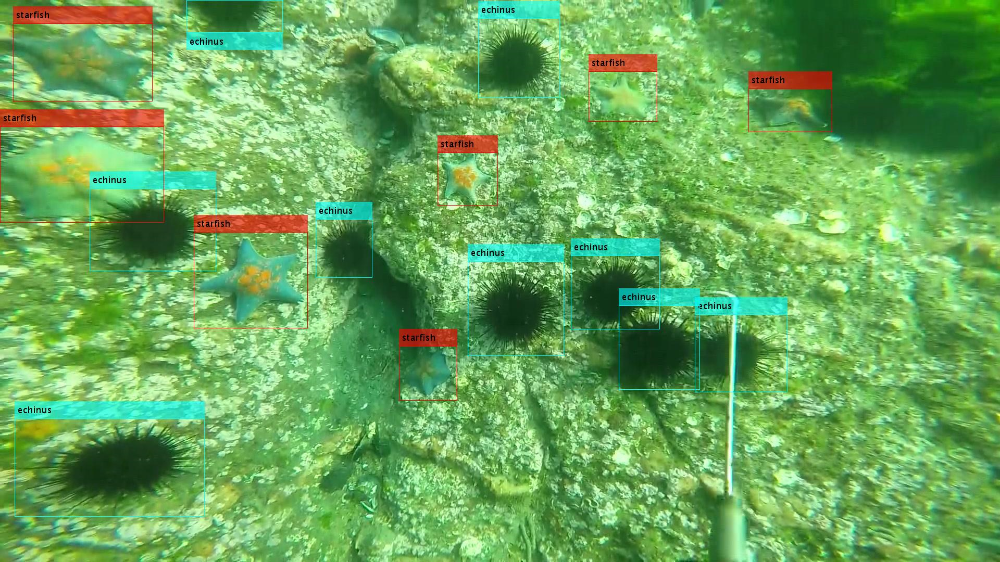
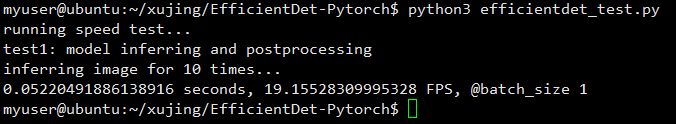
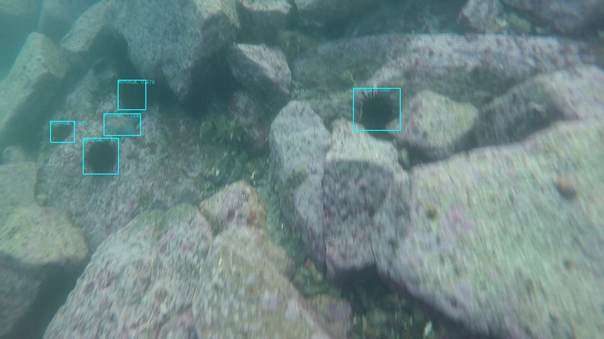
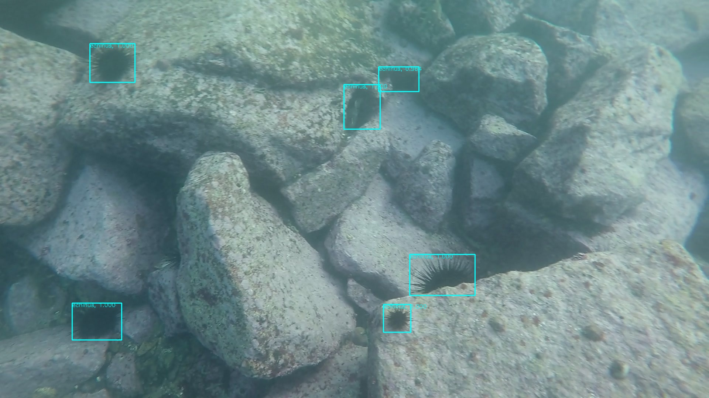
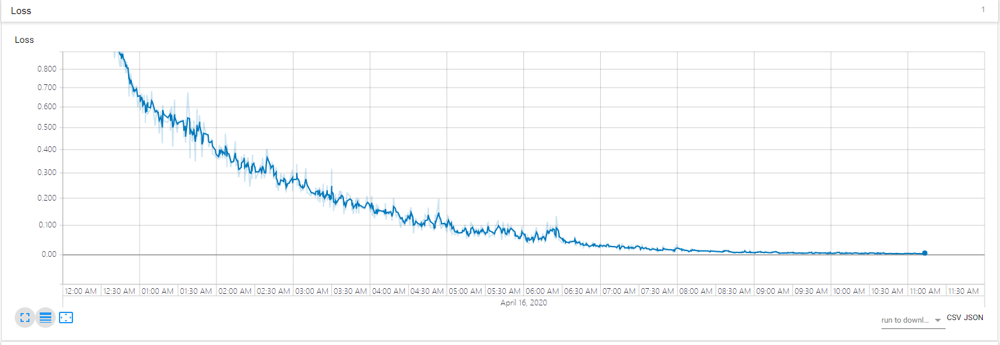
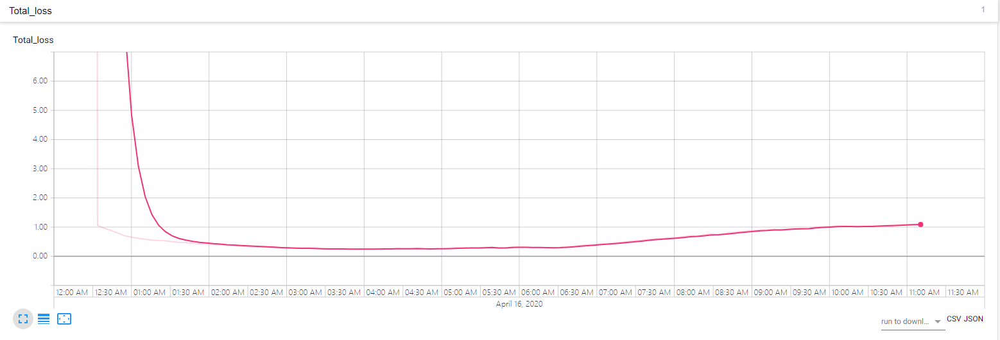
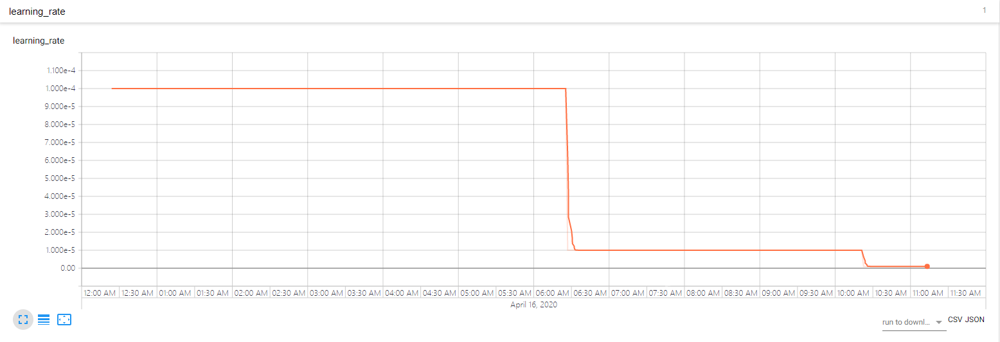

## EfficientDet训练自己的数据集

**Xu Jing**

Paper：<https://arxiv.org/abs/1911.09070>

Base GitHub Repo:<https://github.com/zylo117/Yet-Another-EfficientDet-Pytorch>

Official Repo:<https://github.com/google/automl/tree/master/efficientdet>

EfficientDet 算法中文介绍：[EfficientDet_CN.md](./EfficientDet_CN.md)

> 本项目以一个真实比赛的数据集，Step by Step演示如何训练最近开源的相对SOTA的Pytorch版的EfficientDet的训练，评估，推断的过程。像paper中提到的一样，我们并没有使用任何数据增强或模型融合等后处理的trick来提高模型的精度，如果你想增加数据增强的策略可以在`efficientdet/dataset.py`中实现；
>
> 此外我们并没有采用类似于[UWGAN_UIE](https://github.com/DataXujing/UWGAN_UIE)，水质迁移（WQT），DG-YOLO或一些水下去雾算法的办法，预处理水下的图像；
>
> 相信这些trick同样会提高模型识别的精度！！！

### 1.数据来源

数据来源于[科赛网中的水下目标检测的比赛](https://www.kesci.com/home/competition/5e535a612537a0002ca864ac/content/2)：


**大赛简介**

「背景」 随着海洋观测的快速发展，水下物体检测在海军沿海防御任务以及渔业、水产养殖等海洋经济中发挥着越来越重要的作用，而水下图像是海洋信息的重要载体，本次比赛希望参赛者在真实海底图片数据中通过算法检测出不同海产品（海参、海胆、扇贝、海星）的位置。



「数据」 训练集是5543张 jpg 格式的水下光学图像与对应标注结果，A榜测试集800张，B榜测试集1200张。

「评估指标」 mAP（mean Average Precision）

> 注：数据由鹏城实验室提供。

### 2.据转换

我们将数据存放在项目的dataset下：

```
..
└─underwater
    ├─Annotations #xml标注
    └─JPEGImages  #jpg原图
# 首先划分训练集和验证集：我们采用9:1的随机换分，划分好的数据等待转化为COCO数据
```

划分训练集和验证集后的数据结构：

```
..
├─train
│  ├─Annotations
│  └─JPEGImages
└─val
    ├─Annotations
    └─JPEGImages
```

将VOC转COCO：

```
python voc2coco.py train.txt ./train/Annotations instances_train.json ./train/JPEGImages 
python voc2coco.py val.txt ./val/Annotations instances_val.json ./val/JPEGImages 
# 生成的json文件存放在了dataset/underwater/annotations/*.jpg
```


### 3.修改EfficientDet的项目文件

1.新建dataset文件夹用以存放训练和验证数据

```
dataset
└─underwater  # 项目数据集名称
    ├─annotations # instances_train.json,instances_val.json
    ├─train   # train jpgs
    └─val   # val jpgs
```

2.新建logs文件夹

logs存放了训练过程中的tensprboardX保存的日志及模型

3.修改train.py[训练使用]

```
def get_args():
    parser.add_argument('-p', '--project', type=str, default='underwater', help='project file that contains parameters')
    parser.add_argument('--batch_size', type=int, default=16, help='The number of images per batch among all devices')

```

4.修改efficientdet_test.py[测试新图像使用]

```
# obj_list = ['person', 'bicycle', 'car', 'motorcycle', 'airplane', 'bus', 'train', 'truck', 'boat', 'traffic light',
#             'fire hydrant', '', 'stop sign', 'parking meter', 'bench', 'bird', 'cat', 'dog', 'horse', 'sheep',
#             'cow', 'elephant', 'bear', 'zebra', 'giraffe', '', 'backpack', 'umbrella', '', '', 'handbag', 'tie',
#             'suitcase', 'frisbee', 'skis', 'snowboard', 'sports ball', 'kite', 'baseball bat', 'baseball glove',
#             'skateboard', 'surfboard', 'tennis racket', 'bottle', '', 'wine glass', 'cup', 'fork', 'knife', 'spoon',
#             'bowl', 'banana', 'apple', 'sandwich', 'orange', 'broccoli', 'carrot', 'hot dog', 'pizza', 'donut',
#             'cake', 'chair', 'couch', 'potted plant', 'bed', '', 'dining table', '', '', 'toilet', '', 'tv',
#             'laptop', 'mouse', 'remote', 'keyboard', 'cell phone', 'microwave', 'oven', 'toaster', 'sink',
#             'refrigerator', '', 'book', 'clock', 'vase', 'scissors', 'teddy bear', 'hair drier',
#             'toothbrush']

obj_list = ["holothurian","echinus","scallop","starfish"]# 换成自己的
compound_coef = 2 # D0-D6
model.load_state_dict(torch.load("./logs/underwater/efficientdet-d2_122_38106.pth")) # 模型地址
```

5.修改coco_eval.py[评估模型使用]

```
ap.add_argument('-p', '--project', type=str, default='underwater', help='project file that contains parameters')
```

6.修改efficientdet/config.py 

```
# COCO_CLASSES = ["person", "bicycle", "car", "motorcycle", "airplane", "bus", "train", "truck", "boat",
#                 "traffic light", "fire hydrant", "stop sign", "parking meter", "bench", "bird", "cat", "dog",
#                 "horse", "sheep", "cow", "elephant", "bear", "zebra", "giraffe", "backpack", "umbrella",
#                 "handbag", "tie", "suitcase", "frisbee", "skis", "snowboard", "sports ball", "kite",
#                 "baseball bat", "baseball glove", "skateboard", "surfboard", "tennis racket", "bottle",
#                 "wine glass", "cup", "fork", "knife", "spoon", "bowl", "banana", "apple", "sandwich", "orange",
#                 "broccoli", "carrot", "hot dog", "pizza", "donut", "cake", "chair", "couch", "potted plant",
#                 "bed", "dining table", "toilet", "tv", "laptop", "mouse", "remote", "keyboard", "cell phone",
#                 "microwave", "oven", "toaster", "sink", "refrigerator", "book", "clock", "vase", "scissors",
#                 "teddy bear", "hair drier", "toothbrush"]
COCO_CLASSES = ["holothurian","echinus","scallop","starfish"]
```

7.新建yml配置文件(./projects/underwater.yml)[训练的配置文件]

```
project_name: underwater  # also the folder name of the dataset that under data_path folder
train_set: train
val_set: val
num_gpus: 1

# mean and std in RGB order, actually this part should remain unchanged as long as your dataset is similar to coco.
mean: [0.485, 0.456, 0.406]
std: [0.229, 0.224, 0.225]

# this is coco anchors, change it if necessary
anchors_scales: '[2 ** 0, 2 ** (1.0 / 3.0), 2 ** (2.0 / 3.0)]'
anchors_ratios: '[(1.0, 1.0), (1.4, 0.7), (0.7, 1.4)]'

# must match your dataset's category_id.
# category_id is one_indexed,
# for example, index of 'car' here is 2, while category_id of is 3
obj_list: ["holothurian","echinus","scallop","starfish"]

```


### 4.训练EfficientDet

```
# 从头训练自己的数据集 EfficientDet-D2
python train.py -c 2 --batch_size 16 --lr 1e4

# train efficientdet-d2 在自己的数据集上使用预训练的模型(推荐)
python train.py -c 2 --batch_size 8 --lr 1e-5 --num_epochs 10 \
 --load_weights /path/to/your/weights/efficientdet-d2.pth

# with a coco-pretrained, you can even freeze the backbone and train heads only
# to speed up training and help convergence.
python train.py -c 2 --batch_size 8 --lr 1e-5 --num_epochs 10 \
 --load_weights /path/to/your/weights/efficientdet-d2.pth \
 --head_only True
 
# Early stopping 
#Ctrl+c, 
# the program will catch KeyboardInterrupt
# and stop training, save current checkpoint.

# 断点训练
python train.py -c 2 --batch_size 8 --lr 1e-5 \
 --load_weights last \
 --head_only True
```

### 5.测试EfficientDet

1.评估模型使用coco的map

```
python coco_eval.py -p underwater -c 2 -w ./logs/underwater/efficientdet-d2_122_38106.pth
```

```
# 评价结果
 Average Precision  (AP) @[ IoU=0.50:0.95 | area=   all | maxDets=100 ] = 0.381
 Average Precision  (AP) @[ IoU=0.50      | area=   all | maxDets=100 ] = 0.714
 Average Precision  (AP) @[ IoU=0.75      | area=   all | maxDets=100 ] = 0.368
 Average Precision  (AP) @[ IoU=0.50:0.95 | area= small | maxDets=100 ] = 0.170
 Average Precision  (AP) @[ IoU=0.50:0.95 | area=medium | maxDets=100 ] = 0.351
 Average Precision  (AP) @[ IoU=0.50:0.95 | area= large | maxDets=100 ] = 0.426
 Average Recall     (AR) @[ IoU=0.50:0.95 | area=   all | maxDets=  1 ] = 0.149
 Average Recall     (AR) @[ IoU=0.50:0.95 | area=   all | maxDets= 10 ] = 0.433
 Average Recall     (AR) @[ IoU=0.50:0.95 | area=   all | maxDets=100 ] = 0.464
 Average Recall     (AR) @[ IoU=0.50:0.95 | area= small | maxDets=100 ] = 0.267
 Average Recall     (AR) @[ IoU=0.50:0.95 | area=medium | maxDets=100 ] = 0.429
 Average Recall     (AR) @[ IoU=0.50:0.95 | area= large | maxDets=100 ] = 0.507

```

2.训练过程中的Debug

```
# when you get bad result, you need to debug the training result.
python train.py -c 2 --batch_size 8 --lr 1e-5 --debug True

# then checkout test/ folder, there you can visualize the predicted boxes during training
# don't panic if you see countless of error boxes, it happens when the training is at early stage.
# But if you still can't see a normal box after several epoches, not even one in all image,
# then it's possible that either the anchors config is inappropriate or the ground truth is corrupted.
```

3.推断新的图像

```
python efficientdet_test.py
```

推断速度基本能达到实时：







4.Tensorboard展示结果：

```
tensorboard --logdir logs/underwater/tensorboard
```





